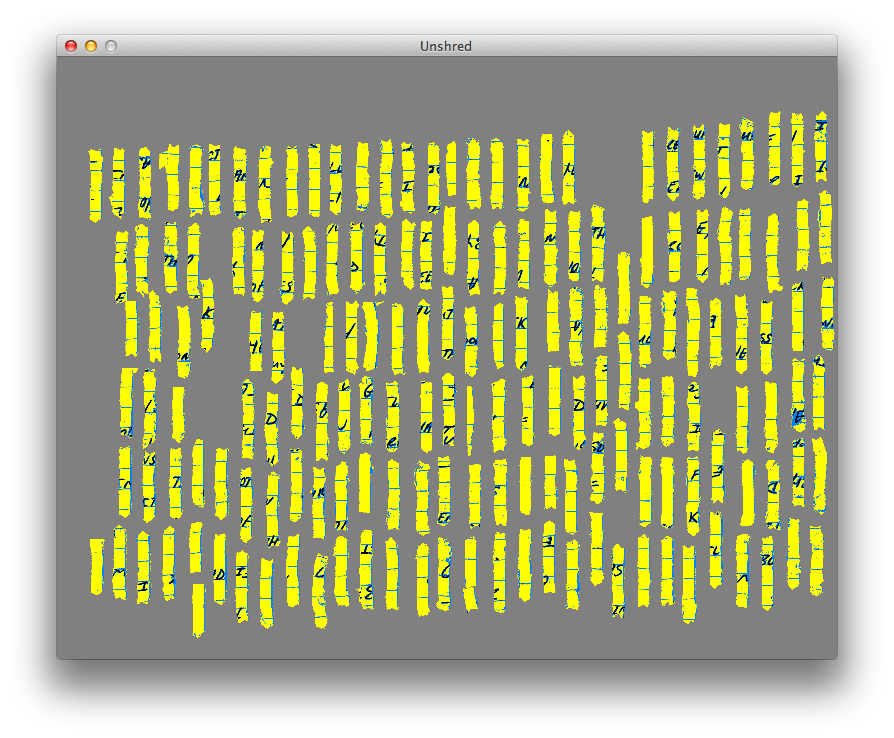

Shredder Challenge
==================

Overview
--------

DARPA posed the [Shredder Challenge][1] in November 2011.

[1]: http://www.shredderchallenge.com/

This is an attempt by Marc Lepage to make progress on the first puzzle.

Unshred
-------

The unshred program is written in Lua using the LÖVE runtime. LÖVE is included for Mac OS X; for other platforms, see the [LÖVE website][2].

[2]: http://www.love2d.org/

The program loads the first puzzle as a PNG image. It scans each pixel to re-colour it based on determined type. Then each row is broken into spans of contiguous chad pixels. The spans are joined together to form chads. Chads that are too small or too large are discarded. The remaining chads are oriented vertically using linear regression after ignoring parts of the chad that are too narrow or wide.

When the program is run, after a short time processing (maybe half a minute), you can see the chads in their original and oriented positions.

That's as far as I got.

Screenshots
-----------

